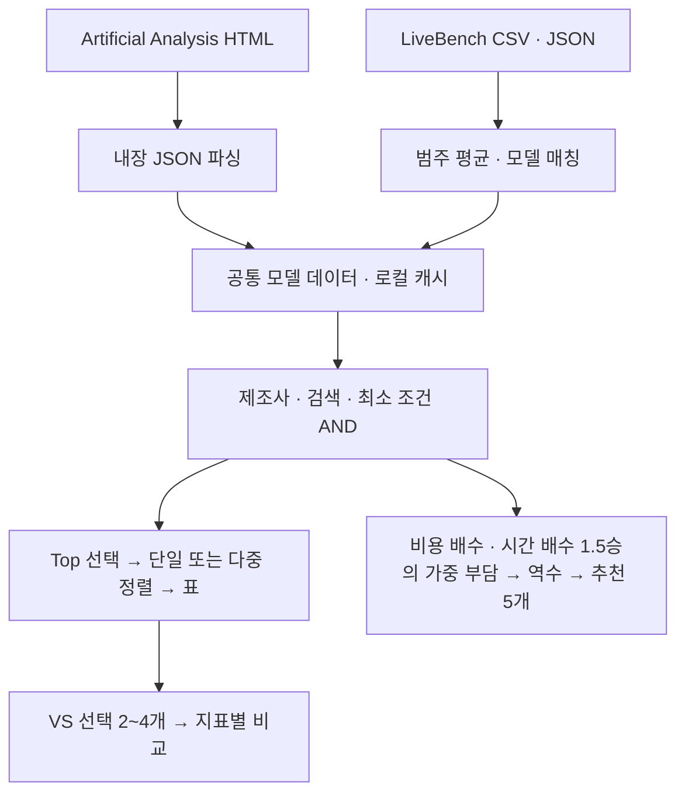

# ai-analysis 기술 스택

ai-analysis는 공개 AI 모델 리더보드의 비용·응답 시간·성능 데이터를 모아 비교하는 Python 애플리케이션이다. 기본으로 단일 HTML 리포트를 만들어 브라우저로 열고, Rich로 터미널 표를 출력하며 Markdown 내보내기도 지원한다. 모델 API를 호출해 직접 벤치마크를 실행하는 프로그램은 아니다.

기준일: 2026-10-09. 버전은 프로젝트 설정과 잠금 파일을 기준으로 한다.

## 주요 기술

| 구분 | 기술 및 버전 | 프로젝트에서의 역할 |
|---|---|---|
| 언어 및 런타임 | Python 3.14 계열 | `.python-version`은 `3.14`, `pyproject.toml`의 요구 버전은 `>=3.14`. 확인된 로컬 가상환경은 3.14.8이다. |
| 환경 및 의존성 관리 | uv | `.venv`와 `uv.lock`으로 실행 환경과 의존성을 관리한다. uv 자체 버전은 프로젝트에서 고정하지 않는다. |
| 패키지 빌드 | setuptools >=80 | `setuptools.build_meta`로 Python 모듈을 패키징하고 `ai-analysis` 실행 명령을 등록한다. |
| HTML 리포트 | HTML · CSS · JavaScript (외부 라이브러리 없음) | 영어 UI, 제조사 탭, AND 필터, 정렬 표, 상세 패널, 체크박스 기반 최대 4개 모델 비교. 데이터는 JSON으로 페이지에 넣고 필터·비교는 브라우저에서 처리한다. |
| 터미널 표 출력 | Rich 15.0.0 | `--print` 표의 색상, 최고 값 강조, 출력 폭 조절을 담당한다. |
| 명령행 인자 | `argparse` | 제조사, 정렬, 표시 개수, 점수 하한, 검색, 새로고침, 출력 형식을 받는다. |
| HTTP 수집 | `urllib.request` | 공개 페이지와 데이터 파일을 가져온다. 요청별 제한 시간은 60초다. |
| 데이터 파싱 | `re`, `json`, `csv`, `io` | HTML 내 JSON 추출, 모델명 정규화, LiveBench CSV 및 분류 JSON 처리를 담당한다. |
| 데이터 모델 | `dataclasses`, 타입 힌트 | 모델명, 제작사, 비용, 시간, 점수와 벤치마크 지표를 `Model`에 담는다. |
| 캐시 및 시간 | `pathlib`, `datetime` | JSON 파일 캐시를 저장한다. 수집 시각은 UTC로 저장하고 화면에서는 로컬 시간으로 표시한다. |

직접 의존성은 Rich 하나이며 정확한 버전을 고정한다. `uv.lock`에는 Rich의 전이 의존성(markdown-it-py, Pygments 등)도 기록되어 있다. 별도 데이터베이스나 웹 서버는 사용하지 않는다.

## HTML 리포트와 Rich 표

기본 실행은 `src/ai_analysis/web.py`가 모든 모델 데이터를 JSON으로 담은 단일 `report.html`을 프로젝트 루트에 만들고 브라우저로 연다. 탭 전환·검색·정렬·상세 표시는 페이지 안의 JavaScript가 처리하므로 서버나 외부 라이브러리가 필요 없다. `--print`로 한 번 출력하는 터미널 표는 Rich로 만든다. 두 화면은 `style.py`의 같은 열 정의와 색 규칙을 쓴다.

## 코드 구성

| 파일 | 책임 |
|---|---|
| [`ai_compare.py`](../ai_compare.py) | 루트 실행 파일(더블클릭용). 의존성이 없으면 `uv run --project`로 다시 실행한다. 더블클릭으로 터미널 표를 출력한 경우에만 종료 전 대기한다. |
| [`src/ai_analysis/cli.py`](../src/ai_analysis/cli.py) | CLI 인자 처리. 기본은 HTML 리포트 갱신 후 브라우저 열기, `--print`/`--markdown`이면 Rich 및 Markdown 표 생성. `ai-analysis` 명령의 진입점. |
| [`src/ai_analysis/data.py`](../src/ai_analysis/data.py) | 데이터 수집·파싱·캐시, 모델명과 추론 강도 정규화, 모델 선별 및 정렬. |
| [`src/ai_analysis/style.py`](../src/ai_analysis/style.py) | 공통 열 정의, 제작사 색상, 최고 값과 상위·하위 30% 구간의 스타일 규칙. |
| [`src/ai_analysis/web.py`](../src/ai_analysis/web.py) | 브라우저용 단일 HTML 리포트(`report.html`) 생성. 필터·정렬·검색은 페이지 안의 JavaScript가 처리한다. |
| [`pyproject.toml`](../pyproject.toml) | 프로젝트 정보, Python 요구 버전, 직접 의존성, setuptools 빌드 설정. `ai-analysis` 명령을 `ai_analysis.cli:main`에 연결한다. |
| [`uv.lock`](../uv.lock) | 직접 및 전이 의존성의 해석 결과와 버전 고정. |

## 데이터 흐름

1. 기본 실행은 매번 외부 데이터를 새로 수집한다. `--cached`를 지정하면 유효한 캐시를 먼저 사용한다. 캐시 기본 유효 기간은 6시간이다.
2. Artificial Analysis 리더보드 HTML에 포함된 Next.js 데이터에서 JSON 객체를 정규식으로 추출한다. Next.js는 수집 대상 사이트의 기술이며 이 프로젝트의 실행 의존성은 아니다.
3. LiveBench 홈페이지의 JavaScript 번들에서 날짜 후보를 찾고, 최신 날짜부터 CSV 표와 분류 JSON을 요청한다. 모델명과 추론 강도를 정규화해 Agentic Coding 및 Coding 점수를 결합한다.
4. 유한한 점수와 양수 작업당 비용이 있는 모델을 `Model`로 변환한다. Next.js의 `$undefined` 등 숫자가 아닌 값과 비유한 수는 누락 값으로 처리하며 선택 지표가 누락되어도 나머지 열을 표시한다. 제조사·최소 Intelligence·최소 Terminal·검색 조건을 AND로 적용한 다음 점수 상위 N개를 고르고, 요청한 지표로 정렬한다. 정렬 지표가 없는 모델은 마지막에 배치한다.
5. 기본으로 루트의 `report.html`을 만들어 브라우저로 열고, `--print`에서는 터미널 표, `--markdown`에서는 Markdown 표를 출력한다.

데이터 수집에는 브라우저 자동화나 JavaScript 실행 엔진을 쓰지 않는다. 브라우저는 완성된 리포트를 보여 주는 데만 쓴다.

현재 채택한 수집 방식은 Artificial Analysis의 HTML 내 JSON 추출과 LiveBench의 공개 CSV·JSON 다운로드다. 두 사이트의 인증 API는 호출하지 않으며 API 키도 사용하지 않는다. 브라우저에서 필터·정렬·VS를 조작할 때는 HTML에 포함된 데이터만 처리하므로 외부 수집 요청이 발생하지 않는다.

기본 캐시 파일은 `.cache/models.json`이며 원본 모델 데이터, LiveBench 데이터, 수집 시각과 표 날짜를 저장한다. `--from-html`은 Artificial Analysis 입력을 로컬 HTML로 대체하지만 LiveBench 수집은 여전히 시도하므로 완전한 오프라인 모드는 아니다.

## 환경 설정

실행 옵션과 화면 조작은 [사용법](usage.md)에 모아 둔다. 아래 환경 변수는 수집 주소와 캐시 정책을 제어한다.

| 환경 변수 | 기본값 | 용도 |
|---|---|---|
| `AA_URL` | `https://artificialanalysis.ai/leaderboards/models` | Artificial Analysis 수집 주소 |
| `LB_URL` | `https://livebench.ai` | LiveBench 기본 주소 |
| `AA_CACHE_DIR` | 프로젝트의 `.cache` 디렉터리 | 캐시 저장 위치 |
| `AA_CACHE_TTL_HOURS` | `6` | 캐시 유효 기간 |
| `AA_PAUSE` | 실행 환경에서 판단 | 더블클릭 실행 및 종료 대기 판단에 사용. `1`로 활성화하고 `0`으로 비활성화한다. |

Windows 탐색기 더블클릭 감지는 `ctypes`의 Windows API로 처리하며 Windows에서만 실행하도록 조건이 걸려 있다. 일반 실행 명령은 `ai-analysis` 또는 `uv run ai_compare.py`다. 사용법은 [`usage.md`](usage.md)를 참고한다.

## 수집 원본과 계산 기준

공식 API로 모델을 평가하는 방식이 아니라 공개 웹 페이지와 CSV를 읽는다. Artificial Analysis의 `intelligenceIndex`, `intelligenceIndexCostPerTask`, `medianEndToEndResponseTimeSeconds`, `terminalBench40`을 각각 Intelligence, Cost, Time, Terminal에 연결한다. Terminal 원본은 0~1 비율이며 화면 표시와 필터에는 100을 곱한 백분율을 사용한다.

LiveBench는 `table_YYYY_MM_DD.csv`와 `categories_YYYY_MM_DD.json`을 읽고, 해당 범주의 값이 있는 하위 작업 점수만 산술평균한다. 모델명과 추론 강도가 정규화 후 일치하는 경우에만 결합한다. 매칭 실패나 결측값은 0점으로 대체하지 않고 `–`로 표시한다.

2026-10-09 검증에서는 수집된 Artificial Analysis 원본의 네 지표와 변환된 모델 값을 대조했고, LiveBench CSV를 다시 받아 범주 평균을 대조했다. 당시 값은 모두 일치했으며 LiveBench 정규화 키의 중복도 없었다. 이는 수집·변환의 일치 검증이며, 외부 벤치마크 자체의 측정 정확성을 보증하는 것은 아니다.

상단 `Collected`는 데이터 수집 시각이며 로컬 시간의 `YYMMDD HH:mm` 형식으로 표시한다. 문제 세트 릴리스 날짜는 상단에 표시하지 않는다. 2026-10-09 확인 당시 [LiveBench 공식 사이트](https://livebench.ai/)의 최신 릴리스는 2026-06-25였고 문제 세트는 약 6개월마다 갱신한다고 안내했다. 이 날짜가 각 모델의 측정일을 뜻하지는 않는다. HTML을 브라우저에서 새로고침하면 저장된 보고서를 다시 읽으며, 외부 수집은 실행 파일을 다시 실행해야 이루어진다.

## 필터와 비교 동작

Intelligence 기본 하한은 40, Terminal 기본 하한은 0.0이다. Terminal이 0이면 제한을 해제하며, 양수이면 Terminal 값이 없는 모델도 제외한다. 필터·단일 정렬·우위 판정은 원본 값을 사용하고 표시만 소수 첫째 자리로 반올림한다. 다중 정렬의 동률 처리는 아래 규칙을 따른다.

두 최소값은 공통 선택지 `Any`, `40`, `45`, `50`, `55`, `60`으로 제한한다. `Any`는 0에 대응한다. 이전 저장값이 선택지에 없으면 바로 아래 선택지로 맞춘다. 예를 들어 49.2는 45가 되며 별도 항목으로 추가하지 않는다.

VS 체크박스는 서로 다른 모델을 최대 4개까지 선택한다. 두 개 이상 선택하면 동등한 조건의 비교표를 표시하며, 선택 순서는 열 배치에만 영향을 준다. 특정 모델을 기준으로 삼거나 임의의 종합 우승자를 계산하지 않는다. 비용·시간은 낮은 값, Intelligence·Terminal·Agentic은 높은 값을 강조한다. 같은 최고 값이 여러 개면 함께 강조하되 전체 값이 같으면 우위를 표시하지 않는다. 비교 가능한 값이 두 개 미만인 지표도 강조하지 않는다. 모델명은 제작사 색상을 따른다.

`Multi-sort`가 꺼져 있으면 원본 값으로 단일 정렬한다. 켜면 현재 지표가 1차 기준이 되고 이후 클릭한 지표를 2차·3차·4차 순서로 추가한다. 같은 헤더를 다시 누르면 해당 기준의 방향만 반전한다. 다중 정렬에서는 화면에 표시되는 소수 첫째 자리 값으로 동률을 판정한다. Terminal도 백분율로 변환 후 소수 첫째 자리 기준을 적용한다. 상위 표시값이 같을 때만 하위 기준을 적용하고, 결측값은 각 기준에서 뒤로 보낸다. 열 너비와 정렬 표시 영역은 고정해 우선순위 번호를 표시해도 배치가 움직이지 않는다.

비교표는 지표별 고유 값의 순위에 따라 1위 초록, 중간 파랑·연한 노랑, 꼴찌 주황으로 표시한다. 2~4개 비교 수에 맞춰 색을 나누고 동점은 같은 순위·색을 사용한다. 모든 값이 같거나 비교 가능한 값이 하나뿐이면 강조하지 않는다. Time 툴팁에는 최단 시간 대비 실제 증가율도 표시한다.

브라우저 `localStorage`의 `ai-analysis.ui.v1`에 필터·정렬·다중 정렬·비교 선택을 저장한다. 비교 선택은 배열 인덱스 대신 제작사와 모델명으로 복원해 새 수집에서 모델 순서가 달라져도 같은 대상을 찾는다. 사라진 모델은 선택에서 제외한다. 명시적으로 입력한 CLI 필터 옵션은 저장값보다 우선한다. 브라우저 저장소를 사용할 수 없어도 현재 화면 조작은 동작하지만 재실행 시 복원은 되지 않는다.

`Clear`는 비교 선택만, `Clear fav`는 즐겨찾기만 지운다. 즐겨찾기는 `ai-analysis.favorites.v1`에 제작사·모델명으로 저장한다. `Save`는 현재 필터·검색·정렬·추천 비중·즐겨찾기를 `ai-analysis.defaults.v1`에 별도로 저장하며 VS 선택은 포함하지 않는다. 마지막 사용 상태의 자동 저장과 사용자 기본값 저장은 별개다.

`Reset`은 마지막 Save의 설정과 즐겨찾기를 복원하고 VS 선택을 비운다. 저장된 기본값이 없다면 All 제조사, Intelligence 40, Terminal 0.0, Top 20, 비용 오름차순, Multi-sort 꺼짐·즐겨찾기 없음으로 돌아간다. Reset은 명시적 CLI 초기 옵션보다 우선하며 복원 결과도 마지막 사용 상태에 저장한다.

브라우저 갱신은 필요한 영역으로 제한한다. 즐겨찾기는 체크 칸과 행 강조, 모델 선택은 상세 패널과 선택 표시, VS는 체크 칸과 비교표만 갱신한다. 추천 후보와 비중이 같으면 결과 DOM을 재사용하며 동일한 설정의 localStorage 쓰기는 생략한다. 검색 입력은 requestAnimationFrame으로 한 프레임에 한 번 렌더링하고 모델 인덱스 조회는 미리 만든 Map을 사용한다.

## 유지보수 시 참고

`assets/ai-compare.svg`는 앱 아이콘 원본이며 `assets/ai-compare.ico`는 Windows 바로가기용 16~256px 다중 해상도 아이콘이다. 바로가기 자체는 사용자 바탕화면에 있으므로 저장소에 포함하지 않는다.

화면은 필터 결과 수와 무관하게 표·상세·비교 영역의 공간을 유지한다. 표와 비교 영역은 내부 스크롤을 사용하며, 다시 그릴 때 페이지·표의 스크롤 위치를 보존하고 포커스 복원으로 인한 자동 스크롤을 막는다.

공식 API 제공 여부를 2026-10-09 확인했다. [Artificial Analysis](https://artificialanalysis.ai/api-reference)는 키 기반 무료 API를 제공하며 하루 1,000회 제한이 있다. 현재 HTML 수집을 전환하려면 작업당 비용·총 응답 시간·Terminal 등 필요한 필드의 제공 범위를 먼저 대조해야 한다. [LiveBench 공식 리더보드 저장소](https://github.com/LiveBench/new-livebench)는 릴리스별 CSV·JSON 파일을 데이터 인터페이스로 문서화한다. 별도의 공개 REST API 문서는 확인하지 못했다. 이 프로젝트의 수집 방식은 아직 변경하지 않았다.

- Artificial Analysis의 내장 데이터 형식과 LiveBench의 번들·파일명 규칙에 의존한다. 대상 사이트 구조가 바뀌면 수집·파싱 코드를 조정해야 한다.
- LiveBench 수집에서 지정된 네트워크·파싱 오류를 처리하면 해당 지표 없이 나머지 모델 데이터를 반환한다.
- 오류는 CLI의 표준 오류 출력에 표시한다. 숫자 누락 값의 회귀 검사는 `uv run python -m unittest discover -s tests -q`로 실행한다. 별도 로그 파일 회전과 CI 설정은 프로젝트 구성에 포함되어 있지 않다.
- 프로젝트 패키지 버전은 `pyproject.toml`과 `uv.lock`으로 관리한다. Python 런타임 업데이트와 프로젝트 의존성 업데이트는 별개다.

## 화면 데이터 흐름과 추천 계산

`web.py`의 `matchingModels()`가 공통 필터 결과를 만들고 `rows()`와 `recommended()`에 전달한다. 추천은 Top 제한 이전의 결과를 사용한다. 유효한 양수 비용·시간을 모두 가진 모델에서 각각 최솟값을 구하고 `100 / (w × cost/minCost + (1-w) × (time/minTime)^1.5)`를 계산한다. 기본 `w=0.6`이며 0~1을 0.1 간격으로 조정한다. 원본 종합값 내림차순, 비용 오름차순, 시간 오름차순으로 동률을 처리하며 표시만 소수 첫째 자리로 반올림한다. 결측·0·음수는 추천에서 제외한다.

추천은 벤치마크 성능 점수가 아닌 비용·시간 효율의 상대 지표다. 필터 결과에 따라 기준 최솟값과 순위가 변하며 별도 응답 시간 상한은 없다. `costWeight`는 마지막 상태와 Save 기본값에 저장되고, 사용자 기본값 없는 Reset은 60으로 복원한다. `Intelligence`은 Artificial Analysis Intelligence Index의 화면용 짧은 이름이며 전체 명칭은 툴팁에 표시한다.
