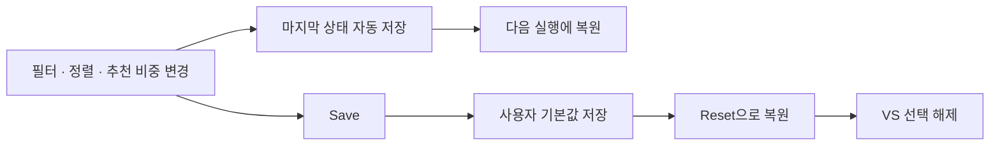

# 사용법

[Artificial Analysis](https://artificialanalysis.ai/leaderboards/models)와 [LiveBench](https://livebench.ai/) 데이터를 모아 AI 모델의 비용·시간·코딩 성능을 한 표로 비교한다. 페이지와 공개 CSV를 내려받아 로컬에서 처리하므로 AI API 토큰은 쓰지 않는다.

| 열 | 내용 | 출처 |
|---|---|---|
| Cost | 작업당 비용 (Intelligence Index 실행 비용 / 작업) | Artificial Analysis |
| Time | 총 응답 시간 (요청 1회 중앙값) | Artificial Analysis |
| Intelligence | Intelligence Index | Artificial Analysis |
| Terminal | Terminal-Bench 4.0 — 터미널 에이전트 코딩 | Artificial Analysis |
| Agentic | Agentic Coding (JS/TS/Python 저장소 작업) 평균 | LiveBench |

색: 굵은 초록은 열 최고 값 · 연두 상위 30% · 회색 하위 30%. 모델명은 Claude 주황 · OpenAI 민트 · Google 파랑. 숫자는 별표 없이 오른쪽으로 정렬한다.
수치는 소수 첫째 자리로 표시한다. 필터·단일 정렬·우위 판정은 원본 값, Multi-sort의 동률 판정은 표시값을 사용한다.
기본 최소 Intel는 40이며, `Min → Int` 또는 `--min`으로 바꿀 수 있다. `Min → Terminal %`과 `--min-terminal`은 최소 Terminal 백분율이며 기본값은 제한 없음이다. 두 조건은 AND로 적용한다.
LiveBench에 모델명과 추론 강도가 일치하는 값이 없으면 Agentic 칸이 `–`로 나온다.

## 실행

필요한 것: [uv](https://docs.astral.sh/uv/), 인터넷.

`ai_compare.py`를 더블클릭하거나 `ai-analysis`를 실행하면 루트의 `report.html`을 최신 데이터로 다시 만들고 브라우저로 연다.

```bash
ai-analysis                               # report.html 갱신 후 브라우저로 열기
ai-analysis --maker claude --sort tb      # 브라우저에서 처음 보일 탭과 정렬
ai-analysis --refresh                     # 캐시 무시하고 데이터 새로 받기
ai-analysis --cached                      # 유효한 캐시 사용 (기본 실행은 새로 수집)
ai-analysis --min 40 --min-terminal 50     # Intelligence >= 40 AND Terminal >= 50%
ai-analysis --out 경로.html               # 다른 위치에 저장 (브라우저는 열지 않음)
ai-analysis --print --top 10              # 브라우저 대신 터미널에 표 출력
ai-analysis --markdown --sort agentic     # 마크다운 표 출력
```

브라우저 화면

| 조작 | 동작 |
|---|---|
| 상단 탭 | 제조사: All · Claude · OpenAI · Google · Other |
| Top 선택 | 점수 상위 20 / 30 / 40 / 50 (기본 20) |
| 기본 표 높이 | 20개 행을 내부 세로 스크롤 없이 표시. Top 30 / 40 / 50에서는 표 내부 스크롤 사용 |
| 검색창 | 모델명 검색(정규식, 예: `opus\|sol`) |
| Intelligence / Terminal | 공통 선택지 Any · 40 · 45 · 50 · 55 · 60. Any는 해당 제한만 해제 |
| Fav 체크 칸 | 즐겨찾기 지정·해제. 체크한 행은 금색 배경·왼쪽 표시선·굵은 모델명으로 강조. 브라우저에 자동 저장되며 새로고침·다음 실행·VS Clear 후에도 유지. Reset은 마지막 Save의 즐겨찾기로 복원 |
| VS 체크 칸 | 최대 4개 선택. 두 개 이상이면 비교표가 나타나며 지표별 순위에 따라 색으로 강조 |
| Clear | 비교 선택만 초기화 |
| Clear fav | 즐겨찾기만 초기화. 저장된 Save 기본값은 유지 |
| Save | 현재 필터·검색·정렬·추천 비중·즐겨찾기를 Reset의 기본값으로 저장. VS 선택은 기본값에 포함하지 않음 |
| Reset | 마지막 Save의 설정과 즐겨찾기 복원 및 VS 선택 해제. 저장한 기본값이 없으면 Intelligence 40, Terminal Any, All 제조사, Top 20, 비용 정렬, Multi-sort 꺼짐·즐겨찾기 없음으로 복원 |
| Multi-sort | 켜면 헤더 클릭 순서대로 정렬 기준 추가. Cost → Time → Intelligence 순으로 누르면 비용 동률에서 시간, 시간도 동률이면 점수 적용 |
| 비교표 순위 색상 | 지표별 1위 초록 · 중간 파랑/연한 노랑 · 꼴찌 주황. 2~4개 비교 수에 맞춰 적용하며 동점은 같은 순위·색, 모두 동점이거나 값이 하나뿐이면 강조 없음. 툴팁에 순위와 Time 증가율 표시 |
| 열 제목 클릭 | 그 열로 정렬, 다시 클릭하면 역순 |
| 행 클릭 | 아래에 가격·속도·컨텍스트 등 상세 |

- `ai-analysis` 명령 설치: 프로젝트 폴더에서 `uv tool install --editable .` 한 번. 설치 없이 `uv run ai_compare.py`도 같다.
- Windows: 루트의 `ai_compare.py` 더블클릭으로도 실행된다.
- Linux: `./ai_compare.py` (`chmod +x ai_compare.py` 한 번).
- `python ai_compare.py`로 실행해도 스스로 `uv run`으로 다시 실행한다.
- 기본 실행은 매번 새로 수집한다. `--cached`일 때 `.cache/`의 유효한 데이터를 사용하며 기본 유효 기간은 6시간이다. 환경 변수 상세와 날짜·계산 기준은 [기술 문서](tech-stack.md)를 참고한다.
- 보고서에서 필터를 낮추거나 바꿔도 비교 선택은 유지된다. 다른 모델을 비교하려면 선택을 해제하거나 `Clear`를 누른다.
- 필터·정렬·VS 선택은 브라우저에 저장되어 새로고침과 다음 실행 때 복원된다. 명시적으로 입력한 CLI 옵션이 있으면 해당 설정이 우선한다.
- HTML 새로고침은 저장된 화면만 다시 연다. 최신 외부 데이터를 받으려면 `ai_compare.py`를 다시 실행한다.

사이트 구조가 바뀌면 "모델 데이터를 찾지 못했습니다"가 출력된다. LiveBench를 못 받으면 Agentic 열만 비고 나머지는 그대로 나온다.

## 추천 순위와 설정 저장

하단 `Recommended`는 현재 필터를 통과한 모델 전체에서 비용·시간의 종합값 `Value`가 높은 5개를 표시한다. Top 개수와 표 정렬은 추천 순위에 영향을 주지 않는다. 기본 비중은 비용 60%, 시간 40%이며 슬라이더로 조절한다. 30초 제한은 없다.

`Value = 100 / (비용 비중 × 모델 비용 / 최저 비용 + 시간 비중 × (모델 시간 / 최단 시간)^1.5)`

비용·시간이 모두 양수인 모델만 계산한다. 비용 부담은 최저 비용 대비 배수, 시간 부담은 최단 시간 대비 배수의 1.5승으로 반영한다. 시간이 2배면 시간 부담 약 2.8배, 10배면 약 31.6배이므로 매우 느린 모델은 저렴해도 추천 점수가 크게 내려간다. 점수는 해당 필터 결과 안에서의 상대값이므로 필터가 달라지면 바뀐다. Intelligence·Terminal은 최소 조건으로만 적용하며 종합값에 다시 더하지 않는다. 추천 비중도 자동 저장되고 Save·Reset에 포함된다.

VS 칸에서 2~4개를 체크한 뒤 표 위의 `VS n/4 ↓`를 누르면 비교표로 이동한다. `Clear`는 선택만 지운다.



상단은 12px AI Comparison 제목·제조사 탭·검색·Save·Reset 한 줄, Top·최소 조건·Multi-sort·결과 수·정렬 상태·VS·Clear fav | Clear 한 줄로 배치한다. Top·Intelligence·Terminal 설명은 각 드롭다운 위에 표시한다. 최소 조건은 Intelligence·Terminal의 마우스 호버 설명으로 안내한다. 검색창은 최대 200px이며 결과 수와 정렬 상태는 오른쪽에 표시한다. 좁은 화면에서는 줄바꿈한다. 수집 시각과 출처는 페이지 맨 아래의 작은 footer에 가운데 정렬하여 표시한다. Top·최소 조건 드롭다운은 같은 80px 너비·26px 높이를 사용하며 Fav·VS 열 제목과 체크 칸은 가운데 정렬한다. 즐겨찾기 변경은 해당 행만 갱신하며, 추천 결과는 후보 모델·비중이 바뀔 때만 다시 만들고 동일한 설정의 중복 저장을 생략한다.

필터 라벨과 숫자는 가운데 정렬하며, Multi-sort는 간격과 구분선을 두고 드롭다운 중앙 높이에 맞춘다. 호버 설명은 짧게 표시하고 상세 계산식은 이 문서에서 설명한다.

모델 행 선택은 상세 패널과 선택 표시만 갱신하고, VS 선택은 체크 칸과 비교표만 갱신한다. 모델 인덱스는 미리 만든 Map으로 찾으며 HTML 이스케이프는 임시 DOM 생성 없이 처리한다. 검색 이벤트가 같은 프레임에 여러 번 발생하면 마지막 상태를 한 번만 렌더링한다.
