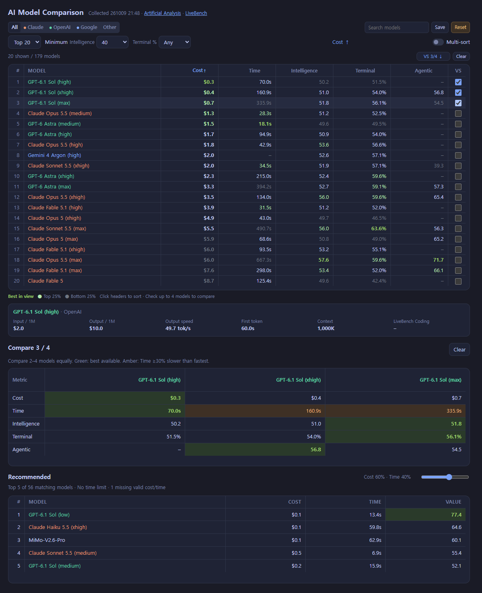

# ai-analysis

Compare AI models by cost, response time, and coding performance in a local browser report. Data comes from [Artificial Analysis](https://artificialanalysis.ai/leaderboards/models) and [LiveBench](https://livebench.ai/). No AI API key or token usage is required.

## Preview



- Filter by provider, model name, and minimum Intelligence and Terminal scores. Both score thresholds must be met.
- Sort by individual metrics or combine multiple sort criteria. Compare up to four models side by side.
- Mark favorites and keep your filters, sorting, and recommendation weights between sessions in the same browser.
- Use **Save** to store current settings and favorites as defaults. **Reset** restores those defaults and clears comparison selections. Both buttons provide visual feedback and a confirmation message.
- Explore five recommendations based on relative cost and response time. The default weights are 60% cost and 40% time; adjust them with the slider. The time ratio is raised to the power of 1.5 to penalize slower models. These recommendations measure cost and time within your filters, rather than overall model quality.

LiveBench scores appear when the model name and reasoning effort match. Missing scores are shown as a dash.

## Quick start

Install [uv](https://docs.astral.sh/uv/) and clone the repository. The project requires Python 3.14 or later; uv manages the project environment. An internet connection is needed to fetch source data.

```sh
git clone https://github.com/savvy773/ai-analysis.git
cd ai-analysis
uv run ai_compare.py
```

The command fetches current data, updates `report.html`, and opens it in your browser. On Windows, you can also double-click `ai_compare.py` if `.py` files are associated with Python and uv is available on your PATH.

To make the `ai-analysis` command available outside the project folder, run `uv tool install --editable .` from the project folder.

| Task | Command |
|---|---|
| Refresh the report and open it | `ai-analysis` |
| Reuse cached data while valid | `ai-analysis --cached` |
| Print a table in the terminal | `ai-analysis --print` |
| Output a Markdown table | `ai-analysis --markdown` |
| Filter by provider and sort by Terminal score | `ai-analysis --maker claude --sort tb` |
| Save HTML without opening a browser | `ai-analysis --out comparison.html` |

The same options work with `uv run ai_compare.py`. Refreshing the browser displays the existing report; rerun the command to fetch new data. The default cache lifetime is six hours.

## Project structure

```
ai-analysis/
├─ ai_compare.py       Launcher
├─ report.html         Generated report (excluded from Git)
├─ docs/
│  ├─ images/          README screenshot
│  ├─ usage.md         Options, controls, and metric definitions
│  └─ tech-stack.md    Architecture and data flow
├─ src/ai_analysis/
│  ├─ cli.py          Command-line options and output modes
│  ├─ data.py         Data collection, parsing, caching, and sorting
│  ├─ web.py          HTML report and browser interactions
│  └─ style.py        Columns and color rules
└─ tests/             Data validation and launcher regression tests
```

## Documentation

Detailed documentation is currently in Korean:

- [Usage guide](docs/usage.md): controls, metric definitions, and the recommendation formula.
- [Technical guide](docs/tech-stack.md): data sources, environment variables, and architecture.
